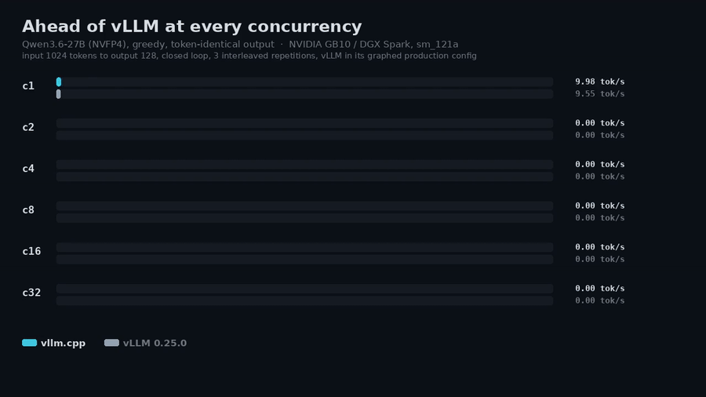
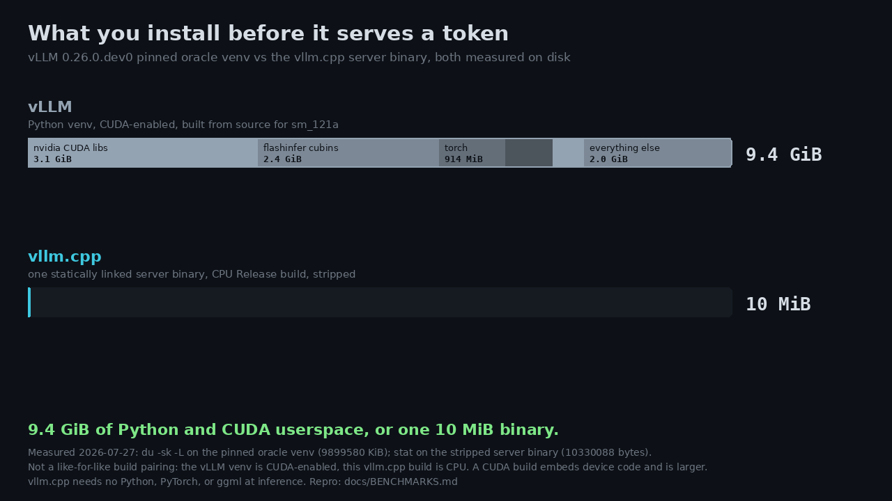

# vllm.cpp

**Brought to you by the [LocalAI](https://github.com/mudler/LocalAI) team**, the folks behind LocalAI, the open-source AI engine that runs any model (LLMs, vision, voice, image, video) on any hardware, no GPU required.

[](LICENSE)
[](https://github.com/mudler/LocalAI)

A lightweight, community-first vLLM. vllm.cpp is a from-scratch C++20 port of
[vLLM](https://github.com/vllm-project/vllm)'s serving engine, continuous batching, paged KV cache,
prefix caching and speculative decoding included, with no Python, PyTorch, or ggml at inference time.
It ships llama.cpp-style as one library behind a flat C ABI, plus a CLI and an OpenAI-compatible
server. It loads Hugging Face **safetensors** and **GGUF** checkpoints, and builds for CUDA, CPU,
Metal, and Vulkan from one source tree.



**It holds up under load.** Against vLLM itself on Qwen3.6-27B (NVFP4, GB10), the output is
token-for-token identical and the total throughput is higher at every concurrency:

| Concurrency | 1 | 2 | 4 | 8 | 16 | 32 |
|---|---|---|---|---|---|---|
| Ours (tok/s) | 86.05 | 159.68 | 292.34 | 508.77 | 801.76 | 1095.01 |
| vLLM (tok/s) | 82.32 | 158.03 | 290.31 | 505.46 | 789.16 | 1076.25 |
| **Ratio** | **1.045x** | **1.011x** | **1.007x** | **1.007x** | **1.016x** | **1.017x** |

It does that in 24.88 GiB of peak host memory against vLLM's 28.18 GiB, from a binary with no Python
stack behind it. That last part is not a detail:



> **Pre-release, under heavy development.** Correctness is gated token-for-token against a pinned
> vLLM oracle across 25+ architectures. Speed is proven on one GPU (NVIDIA GB10 / DGX Spark,
> sm_121a) plus a CPU path that matches or beats llama.cpp on GGUF. Every capability is labelled
> honestly in [docs/STATUS.md](docs/STATUS.md): *correctness-complete*, *speed-pending*,
> *build-only*, or *hardware-blocked*. The full evidence is in
> [docs/BENCHMARKS.md](docs/BENCHMARKS.md).

## Quickstart

```sh
# Build (CPU; the server is ON by default)
cmake -S . -B build && cmake --build build -j
```

```sh
# Serve an OpenAI-compatible endpoint
build/examples/server --model /path/to/Qwen3.6-27B --port 8000 --max-num-seqs 32
```

```sh
curl http://localhost:8000/v1/completions \
  -H 'Content-Type: application/json' \
  -d '{"model": "Qwen3.6-27B", "prompt": "The capital of France is", "max_tokens": 64}'
```

Any OpenAI client works by pointing its `base_url` at it. For a one-shot completion without a
server, use `build/examples/vllm-cli --model <dir> --prompt "..."`.

## Features

- **vLLM's serving core.** Continuous batching, block-paged KV cache, automatic prefix caching (on
  by default for dense models), and the V1 / Model Runner V2 scheduler and engine step loop.
- **Sampling.** Greedy, temperature, top-k/p, min-p, presence/frequency/repetition penalties, seed,
  stop sequences, `logit_bias`, `allowed_token_ids`, and `bad_words`, in vLLM's exact order, plus
  sample logprobs.
- **Structured output.** JSON schema, JSON object, regex, choice, and GBNF grammar, enforced in the
  engine with a per-step logits bitmask.
- **Tool calling and reasoning.** 36 tool-parser families (40 accepted names) and 7 reasoning
  parsers, streaming, selectable with `--tool-call-parser` / `--reasoning-parser`.
- **Speculative decoding.** MTP, block-diffusion DFlash, and draft-free ngram via
  `--speculative-config`, the same JSON vLLM takes.
- **Multimodal.** Image, video, and audio to text, correctness-complete on a single-sequence path
  (not yet wired into the OpenAI server).
- **Quantization.** NVFP4 W4A4/W4A16, compressed-tensors NVFP4A16, GGUF F32/F16/Q4_0/Q8_0/Q3_K/Q4_K/
  Q5_K/Q6_K, and an FP8 W8A8 slice. On CPU the GGUF block encodings compute directly on the
  compressed blocks, with no BF16 expansion.
- **External KV.** KV offload to CPU/disk and an `lm://` LMCache client, plus KV-cache events for
  external routers. Opt-in, off by default.
- **Backends.** CUDA, CPU, Metal, and Vulkan from one source tree.

Per-capability lifecycle state, active gaps, and the next gate for each: [docs/STATUS.md](docs/STATUS.md).

## Supported models

Every architecture below passes a token-for-token correctness gate against the pinned vLLM oracle on
GB10. Where vLLM's own greedy is deterministic the bar is strict token-exact; where vLLM is
self-inconsistent at bf16 near-ties, the bar is a near-tie-robust check. "Speed" is a separate bar
(match or beat vLLM on every axis), tracked in [docs/BENCHMARKS.md](docs/BENCHMARKS.md).

| Architecture | Example checkpoint | GGUF | Correctness | Speed |
|---|---|:---:|---|---|
| Qwen3.5/3.6 hybrid (GDN + MoE) | Qwen3.6-27B, Qwen3.6-35B-A3B | 35B only | Token-exact | 27B at/above vLLM; 35B prefill-pending |
| Qwen3 / Qwen2 dense | Qwen3-4B, Qwen3-32B | dense qwen35 | Token-exact (near-tie-robust) | Speed-pending |
| Qwen3-MoE | Qwen3-Coder-30B-A3B | - | Token-exact (near-tie-robust) | Speed-pending |
| Llama-3.x dense | Llama-3.2-1B | - | Token-exact (near-tie-robust) | Speed-pending |
| Mistral dense | Mistral-7B-v0.3 | - | Token-exact | Speed-pending |
| OPT | OPT-125m | - | Strict token-exact | Speed-pending |
| DeepSeek-V2 (MLA) | DeepSeek-V2-Lite | - | Token-exact | Speed-pending |
| GLM-4 dense | GLM-4-9B-0414 | - | Token-exact | Speed-pending |
| GLM-4.7-Flash (MLA MoE) | GLM-4.7-Flash | - | Token-exact (near-tie-robust) | Speed-pending |
| Gemma-3 / Gemma-2 / Gemma-1 dense | gemma-3-1b-it, gemma-2-2b-it, gemma-2b | - | Token-exact (48/48 each) | Speed-pending |
| OLMo-2 dense | OLMo-2-0425-1B | - | Token-exact (near-tie-robust) | Speed-pending |
| OLMo-3 dense | OLMo-3-1025-7B | - | Implemented, oracle-blocked | Speed-pending |
| Granite-3 dense | granite-3.3-2b-instruct | - | Token-exact (16/16) | Speed-pending |
| Phi-3 / Phi-4 dense | Phi-4-mini-instruct, phi-4 (14B) | - | Token-exact (near-tie 16/16) | Speed-pending |
| Phi-1 / Phi-2 dense | microsoft/phi-2 | - | Token-exact (16/16) | Speed-pending |
| StableLM dense | stablelm-2-1_6b | - | Token-exact (16/16) | Speed-pending |
| InternLM2 / InternLM3 dense | internlm2-chat-1_8b, internlm3-8b-instruct | - | Token-exact (16/16 each) | Speed-pending |
| MiniCPM dense | openbmb/MiniCPM-2B-sft-bf16 | - | Token-exact (16/16) | Speed-pending |
| MiniCPM3 (MLA) | openbmb/MiniCPM3-4B | - | Token-exact (16/16) | Speed-pending |
| Yi (Llama architecture) | 01-ai/Yi-Coder-1.5B-Chat | - | Token-exact (16/16) | Speed-pending |
| Command-R / Cohere dense | (HF-gated) | - | Implemented, gate-blocked | Speed-pending |
| Qwen3-VL (image + video) | Qwen3-VL-4B-Instruct | - | Strict token-exact 32/32 (image) | Speed-pending |
| Qwen3.6-27B vision (image + video) | Qwen3.6-27B | - | Strict token-exact 32/32 | Speed-pending |
| Voxtral (audio) | Voxtral-Mini-3B-2507 | - | Near-tie-robust (decoder 48/48 exact) | Speed-pending |

Compressed-tensors NVFP4A16 (W4A16) dense weights also load and compute natively
(RedHatAI/Qwen3-32B-NVFP4A16). Long-context RoPE (YaRN, Llama-3, LongRoPE, dynamic-NTK) and
sliding-window attention are gated feature-positive. Family-by-family detail, including what is
hardware-blocked and why: [docs/STATUS.md](docs/STATUS.md).

## Performance

Measured on NVIDIA GB10 (DGX Spark, sm_121a) against the vLLM 0.25.0 oracle, greedy, closed loop,
input 1024 tokens to output 128, three interleaved repetitions, ratios direction-normalized so 1.0
or higher passes. The full per-axis grids, memory tables, and exact reproduction recipes are in
[docs/BENCHMARKS.md](docs/BENCHMARKS.md).

The headline concurrency table is at the top of this file. Alongside it, effective parity is 115/124
per-axis metrics (two-grid totality), with the residuals being noise-band coin-flips or a favorable
determinism tradeoff described in the benchmark record. Peak host memory also passes (24.88 GiB vs
vLLM 28.18 GiB). The 35B decode path is at or beyond vLLM everywhere; its remaining gap is prefill
time-to-first-token, tracked as active work.

**CPU vs llama.cpp (GGUF, same file, single binary):** prefill 223.8 tokens/s vs llama.cpp 177.3
(1.18x ahead), decode at parity (24.7 vs 25.4 tokens/s), peak memory 2.83 GiB vs 2.80 (1.01x), and
the output tokens are byte-identical to llama.cpp's greedy decode. This comparison is single-stream
only; no concurrent-serving comparison against llama.cpp has been measured yet.

The two figures above are rendered from these measured numbers by
[`benchmarks/demo/`](benchmarks/demo/), which reads its values from a committed spec so any figure
can be traced back to the run that produced it. There is no side-by-side race clip against
llama.cpp's server yet, because the concurrent-serving comparison behind it has not been measured;
when it is, it will follow the LocalAI house style (identical output, honest measured ratios).

## Build

vllm.cpp uses CMake (>= 3.24) and a C++20 compiler (gcc 13/14 and clang are exercised; the tree
builds -Werror-clean on gcc 14.2). The core has no ML dependencies; the OpenAI server uses a vendored
header-only HTTP transport (cpp-httplib).

```sh
# CPU build (the correctness / CI reference). The server is ON by default.
cmake -S . -B build
cmake --build build -j
ctest --test-dir build
```

```sh
# NVIDIA GB10 build with the vendored fast GDN path.
# Triton-AOT cubins are vendored: Python/Triton is only needed to regenerate
# them (VLLM_CPP_TRITON_REGEN), never to build or run them.
cmake -S . -B build-cuda \
  -DVLLM_CPP_CUDA=ON \
  -DVLLM_CPP_TRITON=ON
cmake --build build-cuda -j
```

The example binaries land under `build/examples/`: `vllm-cli`, `server`, `vllm-bench`, and
`tokenize`.

### CMake options

Read from [`CMakeLists.txt`](CMakeLists.txt). Defaults shown are the shipped defaults.

| Option | Default | Purpose |
|---|---|---|
| `VLLM_CPP_CUDA` | `AUTO` | Build the CUDA backend: `ON`, `OFF`, or `AUTO` (on when a CUDA toolchain is found) |
| `VLLM_CPP_CUDA_ARCHITECTURES` | `121a` | Target CUDA arch(s): `121a` (GB10), `120a`/`120a;121a` (consumer Blackwell), and cross-family portable-only targets `90a`, `80`/`86`/`87`/`89`, `100a`/`103a`, `110`. The `a` suffix is required for the native fp4 MMA |
| `VLLM_CPP_METAL` | `AUTO` | Build the Metal backend: `ON`, `OFF`, or `AUTO` (on for an Apple host with an ObjC++ compiler) |
| `VLLM_CPP_VULKAN` | `AUTO` (= `OFF`) | Build the Vulkan backend. Opt-in with `-DVLLM_CPP_VULKAN=ON`; headers are vendored and SPIR-V is committed, so no graphics toolchain is needed |
| `VLLM_CPP_MLX` | `OFF` | Build the optional MLX GEMM provider for Metal (needs `-DMLX_ROOT=<mlx install>`) |
| `MLX_ROOT` | (empty) | Root of an MLX install (`include/` + `lib/`) for `VLLM_CPP_MLX` |
| `VLLM_CPP_SERVER` | `ON` | Build the OpenAI HTTP server (needs `third_party/httplib/httplib.h`; disables itself with a warning if absent) |
| `VLLM_CPP_TRITON` | `OFF` | Consume the vendored per-arch Triton-AOT GDN cubins (CUDA only; no Python needed) |
| `VLLM_CPP_TRITON_REGEN` | `OFF` | Maintainer knob: regenerate the AOT cubins with Python + Triton |
| `VLLM_CPP_CUTLASS_DIR` | `third_party/cutlass` | CUTLASS source root (>= 4.5.0) for the sm120a NVFP4 GEMM |
| `VLLM_CPP_CUTLASS_FETCH` | `OFF` | FetchContent CUTLASS 4.5.0 if not found locally |
| `VLLM_CPP_MARLIN` | `ON` | Build the vendored Marlin NVFP4 W4A16 MoE GEMM (sm_12xa) |
| `VLLM_CPP_BUILD_TESTS` | `ON` | Compile and register ctest targets |
| `VLLM_CPP_BUILD_EXAMPLES` | `ON` | Build the example CLI, server, and bench binaries |
| `VLLM_CPP_BENCH_PROFILE_CONTROL` | `OFF` | Trace-only profiler replay control (never for production timing builds) |

Only GB10 / sm_121a is a runtime-gated CUDA target today. Consumer Blackwell (`120a`) plus the
cross-family portable-only targets are build-supported (they compile and emit real machine code) but
unproven here (no such board), and non-Apple / non-NVIDIA backends run a subset of operations. See
[Acceleration](#acceleration) and the [backend matrix](.agents/backend-matrix.md).

## Running inference (CLI)

`vllm-cli` runs a one-shot completion through the C ABI. Source:
[`examples/cli/main.cpp`](examples/cli/main.cpp).

```sh
build/examples/vllm-cli \
  --model /path/to/Qwen3.6-27B \
  --prompt "The capital of France is" \
  --max-tokens 64
```

| Flag | Default | Meaning |
|---|---|---|
| `--model <dir>` | (required) | Model directory (config.json + tokenizer.json + safetensors) |
| `--prompt "<text>"` | (required) | Prompt text |
| `--tokenizer-config <path>` | (none) | Override `tokenizer_config.json` |
| `--max-tokens N` | `16` | Max tokens to generate |
| `--temperature T` | `0.0` | Sampling temperature (`<= 0` means greedy) |
| `--top-p P` | `1.0` | Nucleus cutoff |
| `--top-k K` | `0` | Top-k (`0` means all) |
| `--seed S` | (unset) | RNG seed (enables seeded sampling) |
| `--stream` | off | Stream token deltas to stdout |
| `--speculative-config '<json>'` | (unset) | Speculative decoding, same JSON as vLLM's flag. See [docs/SPECULATIVE-DECODING.md](docs/SPECULATIVE-DECODING.md) |
| `-h`, `--help` | | Print usage and exit |

A throughput/latency harness, `vllm-bench` ([`examples/bench/main.cpp`](examples/bench/main.cpp)),
takes `--model`, `--dataset-path`, `--num-prompts`, `--input-len`, `--output-len`, `--concurrency`,
`--max-num-batched-tokens`, and `--num-blocks`. A tokenizer smoke tool, `tokenize`
([`examples/tokenize/main.cpp`](examples/tokenize/main.cpp)), takes
`<tokenizer.json | model.gguf> <corpus.txt>`.

## OpenAI-compatible server

`server` is a small HTTP server speaking the OpenAI API. Source:
[`examples/server/main.cpp`](examples/server/main.cpp) and
[`src/vllm/entrypoints/openai/`](src/vllm/entrypoints/openai/). See [Quickstart](#quickstart) for a
runnable example.

```python
from openai import OpenAI
client = OpenAI(base_url="http://localhost:8000/v1", api_key="not-needed")
print(client.completions.create(model="Qwen3.6-35B-A3B",
                                prompt="The capital of France is",
                                max_tokens=64).choices[0].text)
```

Endpoints (registered in
[`src/vllm/entrypoints/openai/api_server.cpp`](src/vllm/entrypoints/openai/api_server.cpp)):

| Method | Path | Purpose |
|---|---|---|
| POST | `/v1/completions` | Text completion (JSON or `text/event-stream`) |
| POST | `/v1/chat/completions` | Chat completion (JSON or streaming SSE) |
| GET | `/v1/models` | List the served model |
| GET | `/health` | Process liveness (200) |
| GET, POST | `/ping` | Liveness probe (200, mirrors `/health`) |
| GET | `/version` | Engine version |
| GET | `/metrics` | Prometheus metrics (`vllm:*` names, text format 0.0.4) |
| POST | `/tokenize` | Tokenize a `prompt` to token ids (optional `token_strs`) |
| POST | `/detokenize` | Detokenize token ids back to text |
| GET | `/server_info` | Server info (`vllm_config`, `vllm_env`, `system_env`) |
| POST | `/reset_prefix_cache` | Reset the prefix cache; returns `{"success": bool}` |

Server flags:

| Flag | Default | Meaning |
|---|---|---|
| `--model <dir>` | (required) | Model directory (safetensors or `.gguf`) |
| `--host H` | `0.0.0.0` | Bind host |
| `--port P` | `8000` | Bind port |
| `--served-model-name N` | model dir basename | Model id in `/v1/models` and responses |
| `--tokenizer-config F` | `<dir>/tokenizer_config.json` | Chat template / tokenizer config |
| `--block-size N` | `32` | KV block size |
| `--num-blocks N` | `256` | KV blocks |
| `--max-model-len N` | `0` (config default) | Max sequence length |
| `--max-num-seqs N` | `8` | Max concurrent sequences (also sizes the HTTP worker pool) |
| `--max-num-batched-tokens N` | `0` (per-arch default) | Per-step token budget |
| `--enable-prefix-caching` / `--no-enable-prefix-caching` | model default | Override automatic prefix caching |
| `--scheduling-policy fcfs\|priority` | `fcfs` | Scheduler policy |
| `--enable-force-include-usage` | off | Force the usage block in responses |
| `--tool-call-parser <name>` | `hermes` | Tool-call dialect (40 names over 36 families). `auto` detects from the chat template, `none` disables |
| `--reasoning-parser <name>` | `none` | Reasoning parser (`think_auto`, `deepseek_r1`, `mistral`, `minimax_m2`, `step3`, `olmo3`). `auto` detects, `none` disables |
| `--kv-transfer-config '<json>'` | (unset) | External KV connector, same JSON as vLLM's flag. See [docs/KV-OFFLOAD.md](docs/KV-OFFLOAD.md) |
| `--speculative-config '<json>'` | (unset) | Speculative decoding (`mtp`, `dflash`, `ngram`), same JSON as vLLM's flag. See [docs/SPECULATIVE-DECODING.md](docs/SPECULATIVE-DECODING.md) |
| `-h`, `--help` | | Print usage and exit |

For a production deployment, use [LocalAI](https://localai.io), which can embed engines like this
behind a model gallery, multi-model serving, the full OpenAI API surface, auth, and metrics.

## Consuming it as a library (C API and C++)

Link `libvllm` (static or shared) and include [`include/vllm.h`](include/vllm.h). It exposes a flat,
exception-free, llama.cpp-style C ABI (`VLLM_ABI_VERSION 9`, 19 exported symbols) suitable for
`dlopen` / FFI / LocalAI integration.

```c
#include "vllm.h"

vllm_model_params mp = vllm_model_params_default();
mp.model_path = "/path/to/model";

vllm_engine *engine = NULL;
if (vllm_engine_load(&mp, &engine) != VLLM_OK) {
    fprintf(stderr, "%s\n", vllm_last_error());
    return 1;
}

vllm_sampling_params sp = vllm_sampling_params_default();
sp.max_tokens = 64;               // sp.temperature = 0.0 means greedy

vllm_completion out;
if (vllm_complete(engine, "The capital of France is", &sp, &out) == VLLM_OK) {
    printf("%s\n", out.text);
    vllm_completion_free(&out);
}
vllm_engine_free(engine);
```

The ABI covers lifecycle, blocking and streaming completion, non-blocking concurrent requests,
memory helpers, and diagnostics. Later ABI versions add structured output (v2), chat with tools and
templates (v3), tool-parser selection (v4), reasoning-parser selection (v5), speculative decoding
(v6), prefix caching (v7), custom logits processors (v8), and the engine-sizing config the bundled
server exposes: chunked-prefill token budget, scheduling policy, and the external KV connector /
LMCache (v9). Chat templates render through the vendored google/minja engine, the same renderer
llama.cpp ships. Full surface: [`include/vllm.h`](include/vllm.h) and
[docs/STATUS.md](docs/STATUS.md).

For C++ consumers, the higher-level surface lives under [`include/vllm/`](include/vllm/):
`LoadedEngine::FromModelDir(...)` ([`entrypoints/model_loader.h`](include/vllm/entrypoints/model_loader.h))
hands back the synchronous `LLMEngine` ([`v1/engine/llm_engine.h`](include/vllm/v1/engine/llm_engine.h))
or the async `AsyncLLM` ([`v1/engine/async_llm.h`](include/vllm/v1/engine/async_llm.h)) the server
itself uses. The underlying portable tensor runtime is `vt::` ([`include/vt/`](include/vt/)), which
carries no ggml or PyTorch dependency.

## Quantization

| Format | State |
|---|---|
| NVFP4 W4A4 / W4A16 | Both gate-model paths run on GB10, token-exact. FP4 tactics match vLLM; Marlin NVFP4 W4A16 grouped-MoE is the 35B expert path |
| compressed-tensors NVFP4A16 (W4A16), dense | Correctness-complete via the Marlin weight-only path; speed not yet measured |
| GGUF F32 / F16 / Q4_0 / Q8_0 / Q3_K / Q4_K / Q5_K / Q6_K | Supported. On CPU the six block encodings compute directly on the compressed blocks (`VT_GGUF_KEEP_QUANT=0` disables it). GPU builds still expand GGUF weights |
| FP8 (W8A8) | The 35B ModelOpt static per-tensor projection slice is implemented; generic FP8 modes and FP8 KV remain open |
| MXFP4 / MXFP8 | Planned |

## Acceleration

| Backend | Hardware | State |
|---|---|---|
| CPU | x86-64 and arm64 | Correctness / CI reference; at or ahead of llama.cpp on every GGUF axis, with an Arm i8mm quant-GEMM tier |
| CUDA | GB10 / DGX Spark, sm_121a | Gate-model correctness passes; 27B at/above vLLM throughput, 35B prefill-pending. The only runtime-gated CUDA target |
| CUDA | Consumer Blackwell, sm_120a | Build-supported (compiles, emits real sm_120a code, all fast paths resolve) but not runtime-proven here (no such card) |
| CUDA | Hopper, sm_90a | Build-supported, portable-kernels-only (accelerated paths disabled); not runtime-proven here |
| CUDA | Ampere/Ada (sm_80/86/87/89), datacenter Blackwell (sm_100a/103a), sm_110 | Build-supported, portable-kernels-only; not runtime-proven here. sm_70/sm_75 are not build-supported (no bf16 tensor cores) |
| Metal | Apple Silicon | Two models run end to end and pass correctness; 18 of 75 ops native. Warm b=1 throughput is 95.9% of MLX-LM, or 97.6% with the optional MLX provider gated to prefill. Indicative ([BENCHMARKS](docs/BENCHMARKS.md)) |
| Vulkan | Portable GPU | Skeleton: 8 ops plus the fusion catalogue run and cross-check against CPU and CUDA. No model runs yet; off unless `-DVLLM_CPP_VULKAN=ON` |
| Intel XPU | Intel GPUs | Spiked, hardware-blocked |
| ROCm / ANE | AMD GPUs / Apple Neural Engine | Post-parity roadmap |

## Why vllm.cpp

vLLM is an excellent serving framework, but running it drags in a heavy Python / PyTorch / CUDA
stack. llama.cpp is wonderfully light, but it is built around one user at a time. vllm.cpp is aimed
at the gap between them:

- **Real concurrency, no Python.** vLLM's continuous batching and paged KV in a single `libvllm`
  behind a flat C ABI ([`include/vllm.h`](include/vllm.h)), easy to embed from C, C++, Go, or Rust,
  or to `dlopen` from LocalAI.
- **Runs on hardware people have.** One source tree for CUDA, CPU, Metal, and Vulkan, loading
  safetensors and GGUF, with no datacenter assumption baked in.
- **Additive by design.** New architectures and new GPU targets land as additive files that mirror
  vLLM's own structure, so upstream changes port mechanically and a contribution stays a small diff.
- **Honest numbers.** Every capability is labelled correctness-complete, speed-pending, build-only,
  or hardware-blocked, and the evidence is in the record.

## Status and project record

The per-capability status ledger is [docs/STATUS.md](docs/STATUS.md), and the measured evidence is
[docs/BENCHMARKS.md](docs/BENCHMARKS.md). The canonical project record lives under
[`.agents/`](.agents/), indexed by [AGENTS.md](AGENTS.md): the append-only
[`.agents/state.md`](.agents/state.md), the [parity ledger](.agents/parity-ledger.md), and the
[model matrix](.agents/model-matrix.md). The portfolio-completion plan is tracked in
[`.agents/specs/roadmap-v1-completion.md`](.agents/specs/roadmap-v1-completion.md).

## Citation

If you use vllm.cpp, please cite this repository and the upstream vLLM project:

```bibtex
@software{vllm_cpp,
  title  = {vllm.cpp: a C++ inference engine porting vLLM},
  author = {Di Giacinto, Ettore},
  url    = {https://github.com/mudler/vllm.cpp},
  year   = {2026}
}
```

vLLM is by the vLLM project ([vllm-project/vllm](https://github.com/vllm-project/vllm)). Model
weights are governed by their own licenses, so check each model card.

## Author

Ettore Di Giacinto ([@mudler](https://github.com/mudler)).

## License

vllm.cpp is released under the [Apache License, Version 2.0](LICENSE). See [NOTICE](NOTICE) for
third-party attributions. The model weights keep their own licenses.

---

Built by the [LocalAI](https://github.com/mudler/LocalAI) team. If you want to run LLMs (and vision, voice, image, and video models) locally on any hardware with an OpenAI-compatible API, [give LocalAI a star](https://github.com/mudler/LocalAI).
